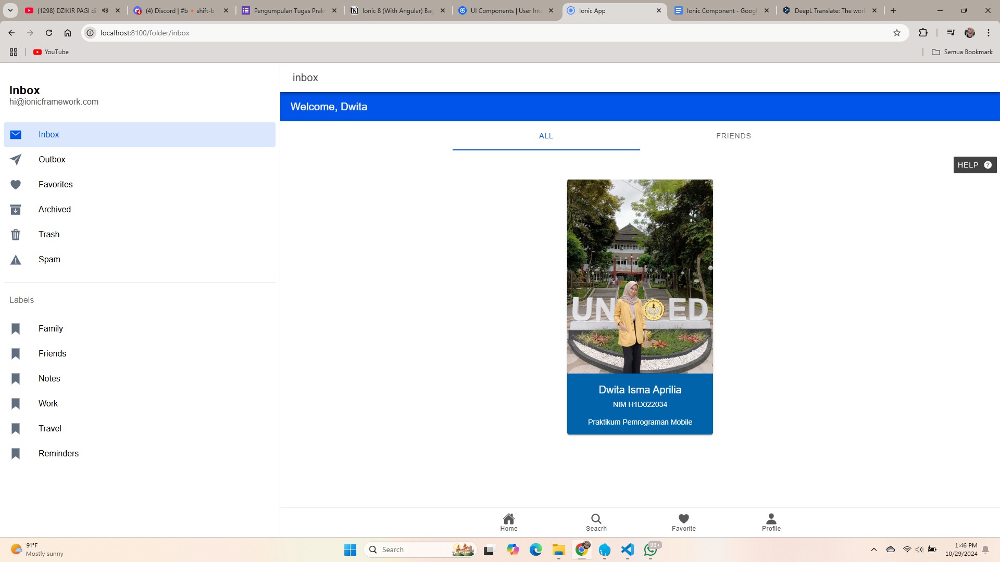

## Langkah-langkah : 
Folder.page.html 

### Ion-Cards : Media Card

1. Menambahkan gambar, dengan cara memasukkan gambar ke dalam folder assets 

2. Mengganti title, subtitle, dan content
   
3. Menambahkan warna pada card 

### Ion-Tabs 

1. Menambahkan Tabs : Listen Now, Radio, Library, Search

2. Mengganti Tabs dengan : Home, Search, Favorite, Profile

### Ion-ToolBar : Basic Usage

1. Menambahkan Header : Header Toolbar
   
2. Mengganti title dengan : Welcome, Dwita

3. Menambahkan warna pada header

### Ion-ToolBar : Buttons in Toolbars

1. Menambahkan Solid Button : Contact, Help

2. Menghapus title Solid Button, Contact

### Ion-Toolbar : Segments in Toolbars

1. Menambahkan Segment in Toolbars : ALL, FAVORITES
   
2. Mengganti FAVORITES dengan : FRIENDS

## Screenshot

